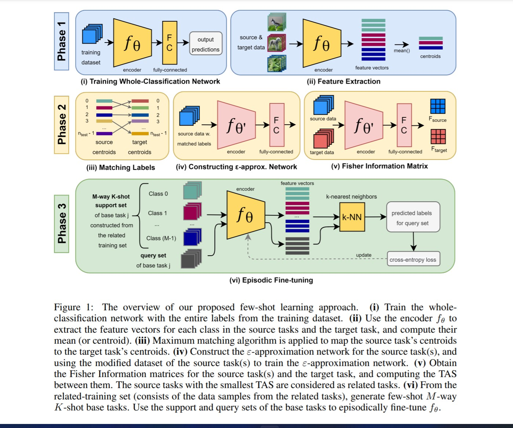
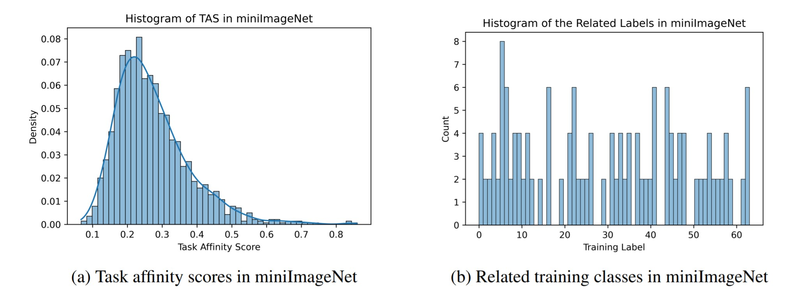
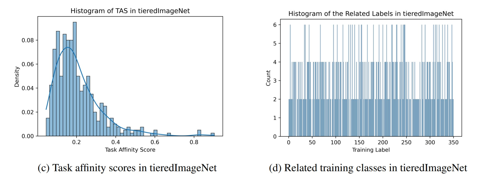

# Task Affinity with Maximum Bipartite Matching in Few-Shot Learning
This is the source code for Task Affinity with Maximum Bipartite Matching in Few-Shot Learning paper (https://arxiv.org/pdf/2110.02399.pdf).

## Description

We propose an asymmetric affinity score for representing the complexity of utilizing the knowledge of one task for learning another one. Our method is based on the maximum bipartite matching algorithm and utilizes the Fisher Information matrix. We provide theoretical analyses demonstrating that the proposed score is mathematically well-defined, and subsequently use the affinity score to propose a novel algorithm for the few-shot learning problem. In particular, using this score, we find relevant training data labels to the test data and leverage the discovered relevant data for episodically fine-tuning a few-shot model. Results on various few-shot benchmark datasets demonstrate the efficacy of the proposed approach by improving the classification accuracy over the state-of-the-art methods even when using smaller models.


<p align="center">
  
</p>

## Getting Started

### Dependencies

* Requires Pytorch, Numpy
* miniImageNet (https://github.com/yaoyao-liu/mini-imagenet-tools)
* tieredImageNet (https://github.com/yaoyao-liu/tiered-imagenet-tools)
* CIFAR-FS (https://github.com/bertinetto/r2d2)
* FC-100 (https://github.com/ElementAI/TADAM)

### Executing program

* First, we define tasks in MNIST, CIFAR-10, CIFAR-100, ImageNet, Taskonomy datasets and use the CNN to train on each task. The weights of the trained CNN is saved for each task.
```
python train_task_mnist.py
python train_task_cifar.py
python train_task_cifar100.py
python train_task_taskonomy.py
```
* Next, we compute the Fisher Information matrices for each pair of tasks using the base task's network. Then, we identify the closest tasks based on the Fréchet of the Fisher Information matrices
```
python fisher-distance.py
python fisher-distance_taskonomy.py
```
Lastly, the FUSE algorithm is applied to find the suitable architecture for the incoming task:
```
python NAS_FUSE.py
```

### Results
The distribution of TAS found in miniImageNet (left) and the frequency of 64 classes in thetop-8 closest source tasks (right) in miniImageNet.
<p align="center">
  
</p>

The distribution of TAS found in tieredImageNet (left) and the frequency of 351 classes in the top-6 closest source tasks (right) in tieredImageNet.
<p align="center">
  
</p>

The table below indicates the comparison of our TA-NAS framework with the hand-designed image classifiers, and state-of-the-art NAS
methods on Task 2 (binary classification) of MNIST.
| Architecture | Accuracy (%) | Paramameters (M) | GPU days |
| :---         |    :---:  |     :---:        |  :---:   |
| VGG-16       | 99.41     |  14.72    | - |
| ResNet-18    | 99.47     |  11.44    | - |
| DenseNet-121 | 99.61     |  6.95     | - |
| Random Search| 99.52     |  2.12     | 5 |
| ENAS (1st)   | 94.29     |  4.60     | 2 |
| ENAS (2nd)   | 94.71     |  4.60     | 4 |
| DARTS (1st)  | 98.82     |  2.17     | 2 |
| DARTS (2nd)  | 99.44     |  2.23     | 4 |
| PC-DARTS (1st)| 98.76    |  1.78     | 2 |
| PC-DARTS (2nd)| 99.88    |  2.22     | 4 |
| TE-NAS        | 99.71    |  2.79     | 2 |
| TA-NAS (ours) | 99.86    |  2.14     | 2 |

## Authors

Cat P. Le (cat.le@duke.edu), 
<br>Juncheng Dong, 
<br>Mohammadreza Soltani, 
<br>Vahid Tarokh